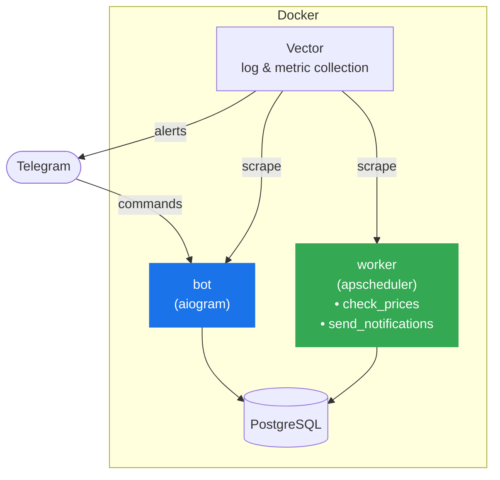

# PriceStation Bot 🎮 💰

<div align="center">
  

  [@PriceStationBot](http://t.me/PriceStationBot)

  [](https://github.com/BlasterAlex/pricestation-bot/actions/workflows/ci.yml)
  [](https://codecov.io/gh/BlasterAlex/pricestation-bot)
  
  [](https://github.com/astral-sh/ruff)
</div>

An automated Telegram bot designed to help gamers find the lowest prices for PlayStation games across different PSN regions.

### Key Features
- **Global Search:** Compare prices across multiple regions (TR, US, UA, PL, etc.) in one click
- **Price Tracking:** Subscribe to your favorite games
- **Smart Notifications:** Get alerts when prices drop or a sale starts
- **Sale History:** Past sales for subscribed games while you track them — see [`docs/features/price-history.md`](docs/features/price-history.md)
- **Currency Conversion:** View all prices converted to your preferred currency (USD by default)

### Commands

| Command             | Description                                                      |
|---------------------|------------------------------------------------------------------|
| `/start`            | Welcome message                                                  |
| `/settings`         | Display currency, tracked regions, sale history format           |
| `/search`           | Search for a game and compare prices across your tracked regions |
| `/subscriptions`    | View your subscribed games with current prices                   |

---

## Architecture



`bot` and `worker` are separate Docker containers sharing the same database.
`bot` handles user commands in real time; `worker` runs background jobs on a cron schedule.

See [`worker/README.md`](worker/README.md) for job details and [`db/models/README.md`](db/models/README.md) for the database schema.

---

## Developer Setup

**Prerequisites:** Docker, Docker Compose, Make.

```bash
# 1. Clone the repo
git clone https://github.com/BlasterAlex/pricestation-bot.git
cd pricestation-bot

# 2. Create deploy/.env (see Environment Variables below)
cp deploy/.env.example deploy/.env  # or create manually

# 3. Start all services (db + migrate + bot + worker)
make dev

# 4. Stop and clean up
make cleanup
```

`make dev` builds the image and starts `db`, `migrate`, `bot`, and `worker` containers in the background.
Migrations run automatically on startup via the `migrate` container.

---

## Running Tests

Tests run inside Docker against a dedicated test database - no local Python setup required.

```bash
make test
```

This builds the image, spins up a temporary PostgreSQL container, runs the full test suite, and exits.
Coverage report is written to `coverage.xml`.

To run a specific subset locally (requires `DATABASE_URL` env var):

```bash
pytest tests/unit/                          # unit tests only (no DB)
pytest tests/integration/                   # integration tests (requires DB)
pytest tests/unit/test_ps_store.py -v       # single file
```

To check linting:

```bash
make lint
```

---

## Environment Variables

Create `deploy/.env` before running. All variables are required unless marked optional.

| Variable                   | Description                                                         | Default        |
|----------------------------|---------------------------------------------------------------------|----------------|
| `BOT_TOKEN`                | Telegram bot token from [@BotFather](https://t.me/BotFather)        | -              |
| `DATABASE_URL`             | PostgreSQL connection string (asyncpg driver)                       | -              |
| `PRICE_CHECK_CRON`         | Cron schedule for the price check job                               | `0 */4 * * *`  |
| `NOTIFY_CRON`              | Cron schedule for the notification job                              | `10 */4 * * *` |
| `NOTIFY_AGGREGATION_HOURS` | Delay before sending a drop notification (batches regional updates) | `9`            |
| `LOG_LEVEL`                | Logging level (`DEBUG`, `INFO`, `WARNING`, `ERROR`)                 | `INFO`         |
| `ALERT_BOT_TOKEN`          | *(optional)* Bot token for Vector → Telegram alerts                 | -              |
| `ALERT_CHAT_ID`            | *(optional)* Chat ID for Vector → Telegram alerts                   | -              |

Example `deploy/.env`:

```dotenv
BOT_TOKEN=123456:ABC-DEF...
DATABASE_URL=postgresql+asyncpg://pricestation:pricestation@db:5432/pricestation
LOG_LEVEL=DEBUG
```

---

## Deployment

```bash
docker compose -f deploy/docker-compose.prod.yml pull
docker compose -f deploy/docker-compose.prod.yml up -d
```

The prod compose file pulls the pre-built image from GHCR (`ghcr.io/blasteralex/pricestation-bot:latest`).
Migrations run automatically before `bot` and `worker` start.

---

## Documentation

| Document                                             | Description                                                  |
|------------------------------------------------------|--------------------------------------------------------------|
| [`worker/README.md`](worker/README.md)               | Worker jobs: price check, notifications, aggregation window  |
| [`db/models/README.md`](db/models/README.md)         | Database schema: tables, relationships, key constraints      |
| [`services/README.md`](services/README.md)           | Services: currency conversion logic, exchange rates, display |
| [`deploy/vector/README.md`](deploy/vector/README.md) | Vector alerting pipeline: sources, transforms, metrics       |
| [`research/README.md`](research/README.md)           | PS Store search grouping research                            |
| [`docs/features/`](docs/features/)                   | Feature overviews (product scope, user-facing behaviour)     |
