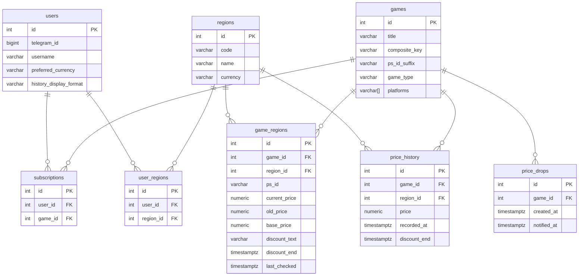

# Database Schema

PostgreSQL 16. Migrations managed with [Alembic](https://alembic.sqlalchemy.org/).

---



---

## Tables

### `users`

Telegram users who have interacted with the bot.

| Column                   | Type          | Notes                                                                   |
|--------------------------|---------------|-------------------------------------------------------------------------|
| `id`                     | serial PK     |                                                                         |
| `telegram_id`            | bigint UNIQUE | Telegram user ID                                                        |
| `username`               | varchar(64)   | nullable                                                                |
| `created_at`             | timestamptz   | server default `now()`                                                  |
| `preferred_currency`     | varchar(8)    | ISO 4217 code for display conversion (e.g. `EUR`); `NULL` means `USD`   |
| `history_display_format` | varchar(16)   | `duration` (default) or `date` for past sale dates; `NULL` → `duration` |

`preferred_currency` is set via `/settings` and controls how prices are converted for display (search results, game cards, price-drop notifications). It accepts any ISO 4217 code supported by the exchange rate API — not limited to PS Store native currencies. Validation happens against live rates at the time the setting is changed.

`history_display_format` is set via `/settings` and controls how past sale timestamps are rendered in subscription history views.

---

### `regions`

PS Store regions the bot supports (e.g. `tr-tr`, `en-us`, `uk-ua`).

| Column     | Type        | Notes                              |
|------------|-------------|------------------------------------|
| `id`       | serial PK   |                                    |
| `code`     | varchar(16) | UNIQUE, locale code e.g. `en-us`   |
| `name`     | varchar(64) | Human-readable name                |
| `currency` | varchar(8)  | PS Store symbol e.g. `TL`, `$`     |

---

### `user_regions`

Which regions each user tracks. Many-to-many join between `users` and `regions`.

| Column      | Type              | Notes |
|-------------|-------------------|-------|
| `id`        | serial PK         |       |
| `user_id`   | FK → `users.id`   |       |
| `region_id` | FK → `regions.id` |       |

---

### `games`

A unique game edition (e.g. "Atomic Heart - Gold Edition PS4/PS5").
One row per logical product, shared across all subscribers and regions.

| Column          | Type         | Notes                                                                                                                                                                          |
|-----------------|--------------|--------------------------------------------------------------------------------------------------------------------------------------------------------------------------------|
| `id`            | serial PK    |                                                                                                                                                                                |
| `title`         | varchar(256) | Canonical title (ASCII preferred)                                                                                                                                              |
| `composite_key` | varchar(512) | UNIQUE. Normalised `title + type + platforms`, used for deduplication across regional search results                                                                           |
| `ps_id_suffix`  | varchar(64)  | Trailing segment of a PS Store product ID (e.g. `ATOMICHEART0GOLD`), shared across all regional prefixes (`UP`/`EP`/`JP`). Used to merge localised-title variants into one row |
| `cover_url`     | text         | nullable                                                                                                                                                                       |
| `game_type`     | varchar(64)  | `FULL_GAME`, `PREMIUM_EDITION`, `GAME_BUNDLE`, etc.                                                                                                                            |
| `platforms`     | varchar[]    | `["PS4"]`, `["PS5"]`, `["PS4","PS5"]`                                                                                                                                          |
| `created_at`    | timestamptz  |                                                                                                                                                                                |

---

### `game_regions`

Per-region price data for a game. One row per `(game, region)` pair.

| Column          | Type              | Notes                                                                                 |
|-----------------|-------------------|---------------------------------------------------------------------------------------|
| `id`            | serial PK         |                                                                                       |
| `game_id`       | FK → `games.id`   |                                                                                       |
| `region_id`     | FK → `regions.id` |                                                                                       |
| `ps_id`         | varchar(128)      | Full PS Store product ID for this region, e.g. `EP4062-CUSA13986_00-ATOMICHEART0GOLD` |
| `current_price` | numeric(10,2)     | Latest fetched price                                                                  |
| `old_price`     | numeric(10,2)     | Price before the last drop (used in notification)                                     |
| `base_price`    | numeric(10,2)     | Original non-discounted price                                                         |
| `discount_text` | text              | e.g. `-70%`                                                                           |
| `discount_end`  | timestamptz       | Sale end time if known                                                                |
| `last_checked`  | timestamptz       | When the price was last fetched                                                       |
| `created_at`    | timestamptz       |                                                                                       |

**Constraint:** `UNIQUE (game_id, region_id)`

---

### `subscriptions`

Which games each user is tracking.

| Column       | Type            | Notes |
|--------------|-----------------|-------|
| `id`         | serial PK       |       |
| `user_id`    | FK → `users.id` |       |
| `game_id`    | FK → `games.id` |       |
| `created_at` | timestamptz     |       |

---

### `price_drops`

Pending notification triggers. A row is created when any region of a game detects a price drop. Deleted (logically) by setting `notified_at` once the notification is sent.

| Column        | Type            | Notes                                           |
|---------------|-----------------|-------------------------------------------------|
| `id`          | serial PK       |                                                 |
| `game_id`     | FK → `games.id` |                                                 |
| `created_at`  | timestamptz     | When the first regional drop was detected       |
| `notified_at` | timestamptz     | Set when notification is sent; `NULL` = pending |

**Key constraint:** partial unique index on `(game_id) WHERE notified_at IS NULL` - only one pending drop per game at a time. Subsequent regional drops for the same game during the aggregation window hit `ON CONFLICT DO NOTHING` and are silently absorbed; their updated prices are already reflected in `game_regions` when the notification eventually fires.

See [`worker/README.md`](../../worker/README.md) for the full aggregation window explanation.

---

### `price_history`

Sale history for subscribed games. Rows are appended by `check_prices` on price drop and seeded on subscribe/sync during active promos. Details: [`services/README.md`](../../services/README.md#price_historypy--sale-history).

| Column         | Type                  | Notes                                              |
|----------------|-----------------------|----------------------------------------------------|
| `id`           | serial PK             |                                                    |
| `game_id`      | FK → `games.id`       |                                                    |
| `region_id`    | FK → `regions.id`     |                                                    |
| `price`        | numeric(10,2)         | Sale price when recorded                           |
| `recorded_at`  | timestamptz           | Drop detection or subscribe/sync time              |
| `discount_end` | timestamptz, nullable | Promo end from PS Store; UI hides row until passed |

**Index:** `(game_id, region_id, recorded_at DESC)`

Rows are shared across subscribers; UI filters by each user's `subscriptions.created_at` and `user_regions`.

---

## Migrations

```bash
# apply all pending migrations
alembic upgrade head

# create a new migration
alembic revision --autogenerate -m "describe change"

# show current revision
alembic current
```

Migrations live in `migrations/versions/`. Run automatically on `make dev` and in prod via the `migrate` container.
