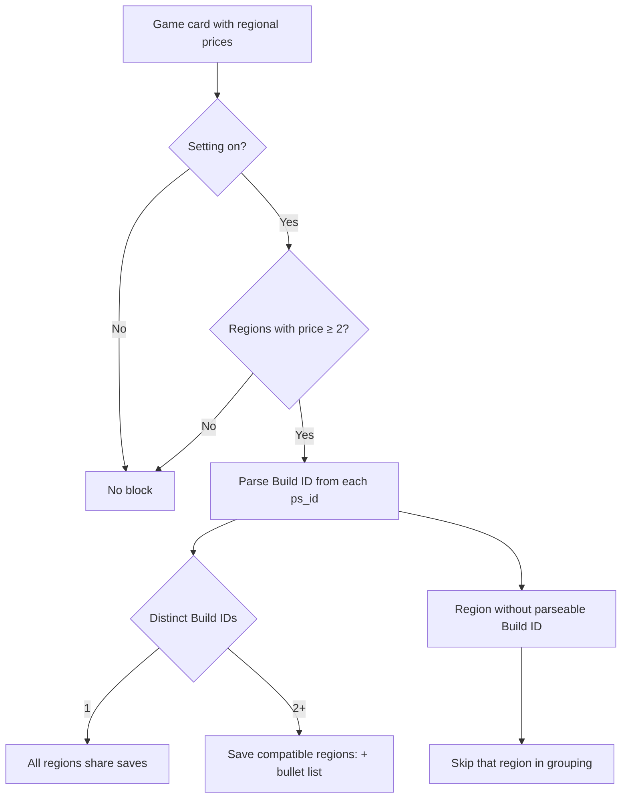

# Cross-Region Save Compatibility (Build ID)

Product overview for [GitHub issue #25](https://github.com/BlasterAlex/pricestation-bot/issues/25).

Implementation details: [`services/README.md`](../../services/README.md) (parsing), [`bot/formatters.py`](../../bot/formatters.py) (display), [`bot/handlers/settings.py`](../../bot/handlers/settings.py) (toggle).

---

## What it is

PlayStation save data is tied to a game's **Build ID** — the concept segment inside the PS Store product ID:

```
UP4040-PPSA01949_00-CONTROLUEPS50000
       ^^^^^^^^^
       Build ID
```

Different regional listings of the same title can have **different** Build IDs (e.g. Control: US/BR share `PPSA01949`, TR/UA/AE share `PPSA01951`). Users who buy in one region and play on another account on the same console need to know which tracked regions are save-compatible.

The bot already fetches `ps_id` per region for prices and store links. This feature **groups regions by Build ID** and shows the result on the game card — no extra PS Store requests.

| Principle                  | Decision                                                             |
|----------------------------|----------------------------------------------------------------------|
| Data source                | Parse Build ID from existing `RegionPrice.ps_id`                     |
| Default                    | Indicator **on**                                                     |
| Setting visibility         | Toggle shown in `/settings` **only when the user tracks 2+ regions** |
| Single region              | Section hidden                                                       |
| All regions, same Build ID | One line: **All regions share saves**                                |
| Multiple Build IDs         | Header **Save compatible regions:** + bulleted flag rows per group   |
| Search list                | No — detail card only (same as sale history)                         |

Build ID is **not** the same as `ps_id_suffix` (used to merge search cards). Suffix identifies the product/edition; Build ID identifies save compatibility.

---

## Where users see it

| Screen                             | Save compatibility block?                           |
|------------------------------------|-----------------------------------------------------|
| `/search` result list              | No                                                  |
| Game detail card (after tap)       | Yes — when setting is on and 2+ regions with prices |
| `/subscriptions` detail (tap game) | Yes — same rules                                    |
| Price-drop push                    | No (v1)                                             |

Block appears **after** “Prices by region”, **before** “Offer ends” and “Past sales” / “Tracking since”.

---

## Display rules



## User-facing text

Exact strings shown on the game card (bot UI is English, same as “Prices by region:”, “Past sales:”, etc.):

| Case               | Line                                                                              |
|--------------------|-----------------------------------------------------------------------------------|
| Multiple groups    | `Save compatible regions:` header, then one `• 🇺🇸 🇧🇷` line per Build ID group |
| Single group       | `All regions share saves`                                                         |
| Unparseable region | Omitted from groups; if too few regions remain, fall back to hiding the block     |

No color markers — groups are separated by line breaks only.

---

## Settings

`/settings` summary line: **Save compatible regions: Visible / Hidden**

Toggle button (💾, no sub-screen):
- visible → `Hide save compatible`
- hidden → `Show save compatible`

- Default: **visible**
- Toggle button is **hidden** when the user tracks only one region (nothing to compare)
- Tap toggles visible ↔ hidden and refreshes the settings message

---

## Parsing

Add `ps_id_build_id(ps_id)` in `services/ps_store.py`:

```python
# UP4040-PPSA01949_00-CONTROLUEPS50000 → PPSA01949
middle = ps_id.split("-", 1)[1]
return middle.split("_", 1)[0]
```

Returns `None` when `ps_id` is missing or does not match the expected shape.

---

## Implementation scope (v1)

| Area                                         | Change                                                                |
|----------------------------------------------|-----------------------------------------------------------------------|
| `services/ps_store.py`                       | `ps_id_build_id()`                                                    |
| `bot/formatters.py`                          | Grouping + block under prices                                         |
| `db/models/user.py` + migration              | `show_cross_region_saves: bool`, default `true`                       |
| `bot/handlers/settings.py`                   | Toggle (conditional on region count)                                  |
| `bot/keyboards/inline.py`                    | Settings button                                                       |
| `bot/handlers/search.py`, `subscriptions.py` | Pass user flag + region count into formatter                          |
| Tests                                        | Parser unit tests; formatter cases (0/1/2+ regions, 1 vs N Build IDs) |

---

## Out of scope (v1)

- Save compatibility on `/search` list cards
- Build ID in push notifications
- Storing Build ID in DB (derived at display time)
- Explaining *why* regions differ (regional publishing splits)
