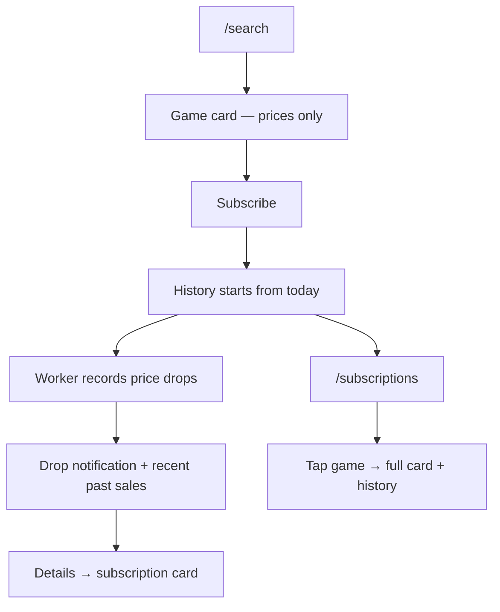

# Price History (Sale History)

Product overview for [GitHub issue #23](https://github.com/BlasterAlex/pricestation-bot/issues/23).

Implementation details: [`services/README.md`](../../services/README.md) (logic & API), [`db/models/README.md`](../../db/models/README.md) (schema), [`worker/README.md`](../../worker/README.md) (recording on price check).

---

## What it is

Subscribers see a **Past sales** list for tracked games — e.g. `174,90 TL — 24 days ago`. History is a **subscription bonus**, not a global price tracker. PS Store has no sale-history API; data accumulates from when the bot starts tracking.

| Principle     | Decision                                           |
|---------------|----------------------------------------------------|
| Scope         | Subscribed games only, user's tracked regions      |
| Storage       | One shared row per sale event per `(game, region)` |
| Personal view | Filtered by subscription date and user settings    |
| Search        | No history on `/search` cards before subscribe     |

---

## Where users see it

| Screen                         | Past sales?                                                   |
|--------------------------------|---------------------------------------------------------------|
| `/search`                      | No — current prices only                                      |
| Subscribe confirmation         | Text hint that history starts from today                      |
| Price-drop push                | Yes — up to 3 ended sales per region; **Details** → full card |
| `/subscriptions` list          | No                                                            |
| Subscription detail (tap game) | Yes — up to 10 ended sales per region                         |

**Tracking since** (subscription start date) is always shown on the detail card. **Offer ends** shows the current promo deadline when applicable.

Active promos are **not** listed under Past sales while they run — current discount is already visible in **Prices by region** and **Offer ends**. After the promo ends, it appears in history.

---

## User flow

---

## Settings

`/settings` → **History format**: show sale dates as relative time (`24 days ago`) or calendar date (`12 Mar 2026`).

---

## Out of scope (v1)

- History before subscribe / after unsubscribe (in UI)
- Backfill from external sources
- Per-user duplicate history rows
- Recording every poll or price increases
- Global tracking of unsubscribed games
