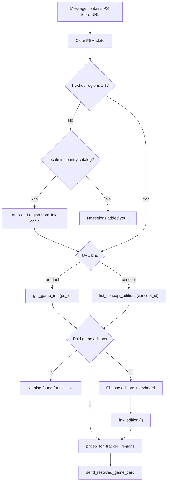

# PS Store Link → Game Card

Product overview — design: [`docs/superpowers/specs/2026-09-26-ps-store-link-open-card-design.md`](../superpowers/specs/2026-09-26-ps-store-link-open-card-design.md).

Implementation details: [`services/ps_store_url.py`](../../services/ps_store_url.py) (URL parse), [`bot/handlers/ps_store_link.py`](../../bot/handlers/ps_store_link.py) (handler), [`services/ps_link_prices.py`](../../services/ps_link_prices.py) (multi-region prices), [`clients/ps_store.py`](../../clients/ps_store.py) (Store HTTP/GQL).

---

## What it is

Users share a PlayStation Store URL from the mobile app or web. The bot resolves it and shows the **same game detail card** as after `/search` → pick a result: cover, multi-region prices, Subscribe, sale history when subscribed, and optional cross-region save block.

Supported URL shapes (host must be `store.playstation.com`; query/hash ignored; URL may appear anywhere in the message):

```
https://store.playstation.com/en-in/concept/10016651
https://store.playstation.com/en-in/product/UP6312-PPSA32718_00-AUGUSTA000000000
```

| Principle              | Decision                                                                 |
|------------------------|--------------------------------------------------------------------------|
| URL types              | `/concept/{digits}` and `/product/{ps_id}` only                          |
| Locale in URL          | Resolve Store API; if user has **no** regions, also seed that storefront |
| Card prices            | User’s **tracked regions** + preferred currency (same as search)       |
| Multi-edition concepts | Inline **Choose edition:** keyboard when 2+ paid game editions           |
| Single edition         | Card opens immediately — no confirmation step                            |
| FSM conflict           | Link **clears** any in-progress search / region-add / currency input   |
| No tracked regions     | Auto-add storefront from link locale if known; else `/settings` hint   |
| Non-matching text      | Falls through to other handlers (no error)                               |

Shorteners, other hosts, and non-concept/product paths are **not** supported.

---

## Where users see it

| Trigger                         | Result                                                                 |
|---------------------------------|------------------------------------------------------------------------|
| Paste or send PS Store URL      | Game card (or edition picker → card)                                   |
| Mid `/search` query             | Link wins — FSM cleared, card shown                                    |
| Mid region add (`/add_region`)  | Same — not stuck waiting for region name                               |
| `/search` result list           | Unchanged — links are not parsed inside search results                 |
| Price-drop push                 | Unchanged — no link handling in pushes                                 |

The card matches search detail: photo when available, **Prices by region**, optional save-compatibility block, **Offer ends**, **Past sales** / **Tracking since**, Subscribe footer.

---

## Flow



---

## Edition picker

When a concept (or resolved product family) has **two or more** purchasable game editions (Full Game, bundles, etc. — same `GAME_TYPES` and paid-outright rules as search):

- Bot sends **Choose edition:** with one inline button per edition (`link_edition:0`, `link_edition:1`, …).
- Titles use game name + type emoji; colliding titles include type label.
- After tap, the bot builds prices and sends the card; FSM `entries` is set so **Subscribe** works like after search.

---

## Multi-region prices

After one product is chosen:

1. Seed `ps_id` and `GameInfo` from the resolved edition.
2. For each tracked region, fetch `RegionPrice`:
   - Prefer `get_game_info` with region-appropriate product id (`remap_ps_id_prefix` / `preferred_ps_prefix`).
   - If that fails, title search in that region and match by `ps_id_suffix` (same idea as search aggregation).
3. Regions with no price are omitted from the card (not invented as N/A).

---

## User-facing errors

| Case                         | Message                                              |
|------------------------------|------------------------------------------------------|
| No tracked regions           | Auto-add from link locale, or settings hint if locale unknown |
| No paid game editions        | `Nothing found for this link.`                       |
| Unresolvable product         | `Couldn't open this PS Store link.`                  |
| Store API / transient failure| `Couldn't open this PS Store link. Try again later.` |

---

## Implementation scope (v1)

| Area                         | Change                                      |
|------------------------------|---------------------------------------------|
| `services/ps_store_url.py`   | `parse_ps_store_url`, `PsStoreLink`         |
| `bot/handlers/ps_store_link.py` | Message handler + `link_edition` callback |
| `bot/handlers/__init__.py`   | Register `ps_store_link` before search      |
| `bot/keyboards/inline.py`    | `link_editions_keyboard`                    |
| `clients/ps_store.py`        | Product search, lookup, and concept GQL     |
| `services/ps_store.py`       | Domain models and pure product-ID helpers   |
| `services/ps_link_prices.py` | `prices_for_tracked_regions`                |
| Tests                        | Parse, API mocks, handler FSM + 0/1/N paths |

---

## Out of scope (v1)

- URL shorteners and non-PlayStation hosts
- Store paths other than concept and product
- “Open this game?” confirmation before the card
- Opening a card when the link locale is unknown and the user has no regions (settings hint only)
