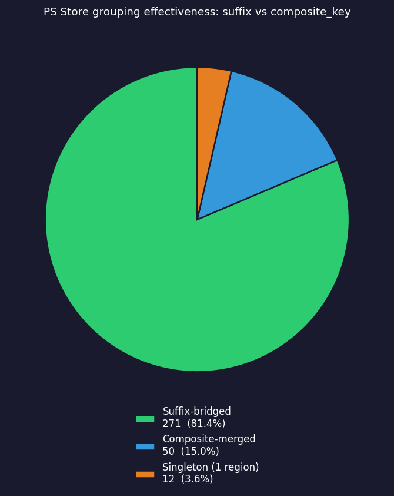

# Grouping Research

Study of two-level PS Store search result grouping effectiveness:

- **Level 1** — `ps_id_suffix`: the trailing segment of a product ID (e.g. `25STANDARDBUNDLE`), shared across all regional prefixes for the same product. Collapses localised-title variants into one card.
- **Level 2** — `composite_key`: normalised title + type + platforms. Fallback when suffixes differ per region (e.g. Lies of P, Bloodborne).

## Contents

| File                       | Description                                              |
|----------------------------|----------------------------------------------------------|
| `dataset.py`               | Regions list and ~100 game titles with category comments |
| `run_grouping_research.py` | Script: searches all regions, analyses groupings         |
| `requirements.txt`         | Script dependencies (`aiohttp`, `matplotlib`)            |
| `results/results.json`     | Raw script output (overwritten on each run)              |
| `results/results.txt`      | Human-readable summary report                            |
| `results/results.png`      | Pie chart: group type distribution                       |

## Usage

```bash
# install research dependencies (once)
pip install -r research/requirements.txt

python research/run_grouping_research.py
```

Results are written to `research/results/`.

## Regions

32 regions covering North America, Europe, Latin America, Asia-Pacific, and the Middle East.

## What We're Measuring

- How many groups each game produces under suffix grouping vs. composite_key only
- Which games correctly collapse into one card across all regions, and which don't
- Where grouping breaks down — spurious duplicates or incorrect merges

## Chart



## Results Format

### `results.txt` — summary table

| Column      | Description                                                                                                   |
|-------------|---------------------------------------------------------------------------------------------------------------|
| `Groups`    | Total number of distinct groups produced for this game                                                        |
| `Suffix`    | Groups formed via `ps_id_suffix` — suffix was essential to merge localised variants                           |
| `Composite` | Groups formed via `composite_key` alone — title/type/platforms matched across regions without a shared suffix |
| `Singleton` | Groups with exactly one region — game found in only one market, no cross-region merge possible                |
| `<!>`       | Flag: at least one suffix-bridged group exists (suffix grouping was needed)                                   |

### `results.json` — raw data

Full per-game detail: all groups with `type`, `region_count`, `regions`, `suffixes`, `composite_keys`, and representative `title`.

### Group types

| Type               | Condition                                | Meaning                                                                       |
|--------------------|------------------------------------------|-------------------------------------------------------------------------------|
| `SUFFIX_BRIDGED`   | 2+ regions, 2+ distinct `composite_key`s | Localised titles differ — suffix was the only way to merge them into one card |
| `COMPOSITE_MERGED` | 2+ regions, 1 `composite_key`            | Title is consistent across regions — composite key alone was sufficient       |
| `SINGLETON`        | exactly 1 region                         | Region-exclusive edition, bundle, or false-positive search result             |
